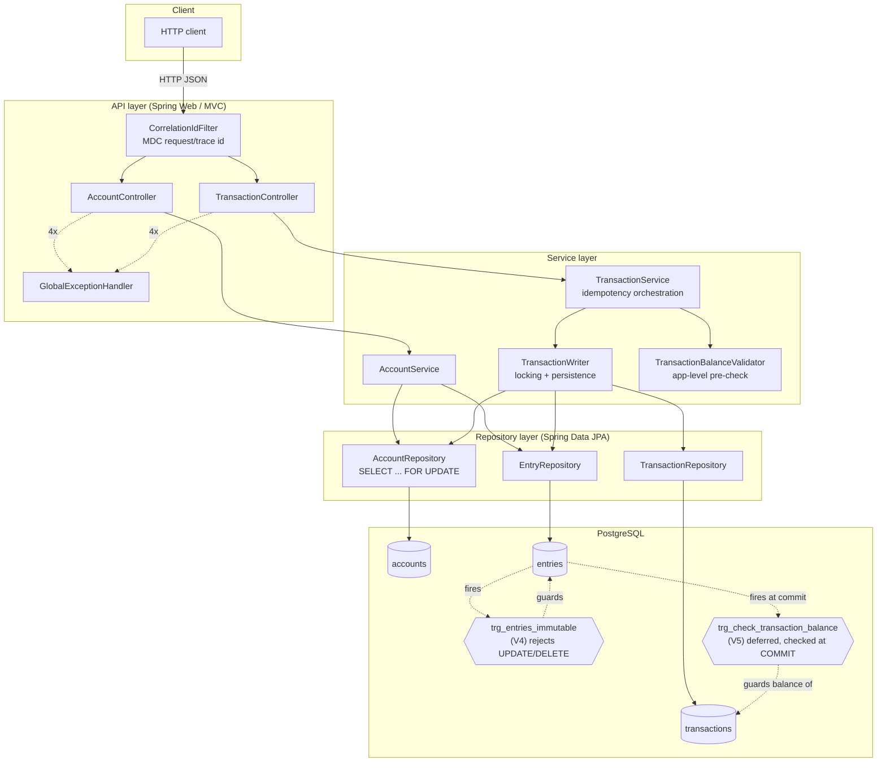

# Double-Entry Ledger Service

A small, correctness-first ledger service built on Java 21 / Spring Boot 3 /
PostgreSQL. It exists to demonstrate how a ledger's core invariants -
balance, immutability, idempotency, and concurrency safety - should be
enforced: **in the database, not just in application code**, because a
constraint cannot race or be bypassed the way an in-memory check can.

## Table of contents

- [Problem statement](#problem-statement)
- [Double-entry accounting, as applied here](#double-entry-accounting-as-applied-here)
- [Architecture](#architecture)
- [How to run](#how-to-run)
- [How to run the tests](#how-to-run-the-tests)
- [API surface](#api-surface)
- [Observability](#observability)
- [Design decisions](#design-decisions)
- [Scope cuts](#scope-cuts)

## Problem statement

Double-entry bookkeeping is a 500-year-old accounting discipline built on one
rule: **every recorded event affects at least two accounts, and the total
value debited must always equal the total value credited.** A "transaction"
(a sale, a transfer, a refund) is really a *set* of individual postings
("entries"), each one either a debit or a credit against a specific account,
and the set is only valid if it balances to zero net movement.

This discipline exists because it makes entire classes of error
self-detecting: money cannot appear or disappear as a side effect of a bug,
because any single-sided change breaks the debit/credit balance and is
mechanically checkable. A ledger service's job is to make that mechanical
check *impossible to bypass* - not a best-effort application-level
validation that a retried request, a concurrent write, or a future
maintenance script could quietly sidestep.

That is the central design commitment of this service: the balance
invariant, entry immutability, and (as far as a single-service scope
allows) safe concurrent posting are enforced by PostgreSQL constraints and
triggers, with application-level checks layered on top only to give
callers a fast, friendly error instead of a raw database exception - never
as the sole line of defense.

## Double-entry accounting, as applied here

- An **account** (`accounts`) is a named bucket of one `account_type`
  (`ASSET`, `LIABILITY`, `EQUITY`) and one ISO 4217 `currency`. It has **no
  stored balance** - see [Design decisions](#why-balances-are-derived-not-stored).
- A **transaction** (`transactions`) is the atomic unit of posting: a
  description, a status (`PENDING` / `POSTED` / `FAILED`), and a set of
  entries. A transaction either posts completely and correctly, or not at
  all.
- An **entry** (`entries`) is one leg of a transaction: an unsigned
  `amount`, a `direction` (`DEBIT` or `CREDIT`), the `account_id` it posts
  against, and the `transaction_id` it belongs to. Entries are
  **append-only** - see [immutability](#db-level-immutability-and-balance-trigger-mechanisms).
- **Balance convention**: this service uses a single, unconditional
  "debit-positive" formula - `balance = sum(DEBIT entries) - sum(CREDIT
  entries)` - independent of `account_type`. Real-world "normal balance"
  accounting (where a credit *increases* a LIABILITY/EQUITY account) is a
  presentation-layer concern callers can derive from this value plus
  `account_type`; keeping the stored/computed formula unconditional avoids
  ambiguity given this service doesn't yet model REVENUE/EXPENSE accounts.
- **Self-transfers / same account on multiple legs**: allowed, deliberately.
  See [Design decisions](#self-transfers).

## Architecture



**Layering, top to bottom:**

1. **Controllers** (`AccountController`, `TransactionController`) - HTTP
   binding, request validation (`@Valid`/Bean Validation), OpenAPI
   annotations. No business logic.
2. **`GlobalExceptionHandler`** - translates every exception the layers
   below can throw into a documented, uniform `ErrorResponse` JSON body
   with the right HTTP status - so nothing below this layer ever needs to
   think about HTTP.
3. **Services** - `AccountService` (simple CRUD/read), and for
   transactions, two collaborating beans: `TransactionService` (idempotency
   orchestration - see below) and `TransactionWriter` (owns every DB
   read/write for transactions/entries, including account-row locking).
   `TransactionBalanceValidator` is a pure, stateless pre-check.
4. **Repositories** - Spring Data JPA interfaces over the three tables.
5. **PostgreSQL** - the schema itself carries two enforcement triggers that
   hold regardless of what the application layer does or forgets to do
   (see below).

## How to run

Requires Docker (for `docker-compose`) - no local JDK/Maven needed just to
run the service, only to build/test it (see next section).

```bash
git clone <this repo> && cd double-entry-ledger

# Clean start: build the app image and start Postgres + the app together.
docker compose up --build

# App: http://localhost:8080
# Swagger UI: http://localhost:8080/swagger-ui.html
# OpenAPI doc (live, generated): http://localhost:8080/v3/api-docs.yaml
# Health: http://localhost:8080/actuator/health
# Metrics: http://localhost:8080/actuator/metrics
```

Flyway migrations run automatically on startup against the `postgres`
service defined in `docker-compose.yml`; there is no separate migration
step. To reset to a genuinely clean state (drop all data, including the
`ledger_postgres_data` volume):

```bash
docker compose down -v
docker compose up --build
```

Config is entirely environment-variable driven (see `application.yml` and
`docker-compose.yml`): `DB_HOST`, `DB_PORT`, `DB_NAME`, `DB_USERNAME`,
`DB_PASSWORD`, `SERVER_PORT`.

## How to run the tests

There are **two separate test suites**, deliberately kept apart:

### 1. Main Testcontainers suite (`mvn test`)

Unit tests plus Postgres-backed integration tests (real Postgres via
Testcontainers - no H2/mocks for anything that touches the schema, because
this schema leans on Postgres-specific behavior: deferred constraint
triggers, CHECK constraints, `gen_random_uuid()`). Requires Docker running
locally (Testcontainers starts its own throwaway Postgres container per
test run).

**JDK version note:** the project targets **Java 21**
(`spring-boot-starter-parent` 3.5.16 requires it), and Maven runs under
whatever JDK `JAVA_HOME` points to - which, on many machines, is *not* the
system default. If `mvn -version` shows a JDK older than 21, point
`JAVA_HOME` at a JDK 21 install before running Maven. This repo ships an
`.sdkmanrc` pinning `java=21.0.1.fx-zulu`; with
[SDKMAN!](https://sdkman.io/) installed:

```bash
# One-time, if you don't already have a JDK 21 via SDKMAN!:
sdk install java 21.0.1.fx-zulu

# From the repo root: auto-switches this shell to the pinned JDK
# (requires `sdkman_auto_env=true` in ~/.sdkman/etc/config, or run
# `sdk env` manually every new shell).
sdk env

mvn test
```

Without SDKMAN!, the equivalent is simply pointing `JAVA_HOME` at any local
JDK 21 install and putting it first on `PATH` for the command, e.g.:

```bash
export JAVA_HOME=/path/to/jdk-21
export PATH="$JAVA_HOME/bin:$PATH"
mvn test
```

### 2. Black-box API test suite (`api-tests/`)

A **standalone Maven module**, intentionally independent of the main
`pom.xml`/`src/test` tree (own `groupId:artifactId`, own dependencies -
REST Assured, Allure, `swagger-request-validator` for OpenAPI-contract
assertions). It exercises the API purely over HTTP against a **live,
already-running instance** - it does not start anything itself. Run it
against the docker-compose stack:

```bash
# In one terminal: start the app (see "How to run" above)
docker compose up --build

# In another terminal (same JDK-21 JAVA_HOME requirement as above):
cd api-tests
mvn test \
  -Dapi.baseUri=http://localhost:8080 \
  -Dopenapi.spec.path=../openapi.yaml
```

Both properties have the defaults shown above, so plain `mvn test` from
`api-tests/` works out of the box against a stack running on
`localhost:8080` with `openapi.yaml` co-located at the repo root as
checked in.

This suite validates actual HTTP responses (status codes, bodies,
`Content-Type`) against `openapi.yaml` as the source-of-truth contract, in
addition to plain correctness assertions - it is what caught the
contract-vs-behavior gaps fixed in Phase 4 (malformed-UUID 500s, the
wrong-Content-Type 500, and the overloaded-409 case). It is owned/maintained
independently of the main test suite; do not merge it into the root
`pom.xml`.

## API surface

See `openapi.yaml` at the repo root (or `GET /v3/api-docs.yaml` on a
running instance, or Swagger UI) for the full, authoritative contract.
Summary:

| Endpoint | Purpose | Idempotent? |
|---|---|---|
| `POST /accounts` | Create an account | No (see [Design decisions](#why-idempotency-keys-are-required)) |
| `POST /transactions` | Post a balanced transaction | Yes, via required `Idempotency-Key` header |
| `GET /transactions/{id}` | Fetch a transaction + its entries | n/a (read) |
| `GET /accounts/{id}/balance` | Derived, on-the-fly balance | n/a (read) |
| `GET /accounts/{id}/entries` | Paginated entry history | n/a (read) |
| `GET /actuator/health` | Liveness + DB connectivity | n/a |
| `GET /actuator/metrics` | JVM + HTTP request metrics | n/a |

## Observability

- **`/actuator/health`** - exposes an aggregate status plus a per-component
  breakdown (`management.endpoint.health.show-details: always`), including
  Spring Boot's built-in `db` health indicator, which runs a real
  validation query against PostgreSQL - so a database outage/misconfig is
  reflected as `DOWN` here, not just as request-time 500s.
- **`/actuator/metrics`** - Micrometer-backed; out of the box this includes
  JVM metrics (heap, GC, threads) and HTTP server request metrics
  (`http.server.requests`, tagged by URI/method/status) with no additional
  code, via `spring-boot-starter-actuator` auto-configuration.
- Only `health` and `metrics` are exposed
  (`management.endpoints.web.exposure.include`) - a deliberate allow-list,
  not `*`: there is no authentication in front of these endpoints in this
  phase (see [Scope cuts](#scope-cuts)), so endpoints that could leak
  configuration/environment details (`env`, `beans`, `configprops`, ...)
  are never exposed.
- **Structured JSON logging** - every log line is emitted as one JSON
  object (`logback-spring.xml`, via `logstash-logback-encoder`), not a
  free-text line, so it's directly machine-parseable by a log aggregator.
- **Correlation id** - `CorrelationIdFilter` assigns a `requestId` (reusing
  an inbound `X-Request-Id` header if the caller supplied one) to every
  request, puts it in SLF4J's MDC for the lifetime of that request, and
  echoes it back as a response header. Every log line emitted while
  handling one request - across controller, service, and repository code -
  therefore carries the same id and can be correlated/grepped back into a
  single request's timeline. This is deliberately *not* a full distributed
  tracing integration (no span model, no exporter, no backend) - just the
  minimum needed for "logs from one request are traceable together",
  which is what was asked for. A real Micrometer Tracing bridge could be
  added later without conflicting with this (it would contribute its own
  `traceId`/`spanId` to the same MDC map).

## Design decisions

### Why balances are derived, not stored

`accounts` has no `balance` column. Every balance is computed on read by
summing `entries.amount` (signed by `direction`) for that account
(`EntryRepository#sumSignedAmountsByAccountId`). A stored, mutable balance
column would be a second, denormalized source of truth that every write
path must keep in lockstep with the entries - and the moment it drifts
(a missed update, a partial failure, a manual data fix), the ledger's
history and its "current state" disagree with no mechanical way to tell
which one is right. Deriving balance from the append-only entry log means
there is only ever one source of truth, and Postgres MVCC/snapshot
isolation already guarantees a balance read sees either *all* of a
committed transaction's entries or *none* of them - never a torn,
half-posted transaction - with no extra mechanism required.

### Why idempotency keys are required (and how replay/conflict detection works)

`POST /transactions` moves money and is exactly the kind of call a client
must be able to safely retry after a timeout/dropped connection without
risking a duplicate posting. There's no other natural dedupe key for a
freshly-created resource (unlike, say, a client-supplied UUID for the
resource itself), so a required `Idempotency-Key` header is the mechanism.

Mechanism (implemented across `TransactionService` + `TransactionWriter`):

1. **Read-before-write.** On every call, first look up an existing
   transaction by `idempotency_key`. If found, compare the stored
   request's fingerprint against the incoming request
   (`IdempotencyRequestMatcher`): identical body -> return the original
   result with **200** (a true replay, no reprocessing); different body ->
   **409** (`IdempotencyKeyConflictException`) - key reuse with a different
   payload is a client bug, not a retry, and must not silently return the
   wrong result.
2. **First-time key.** Not found -> validate the entries balance
   (app-level pre-check, pure arithmetic, no I/O) -> insert the transaction
   + its entries in one DB transaction -> **201**.
3. **Concurrent race on a brand-new key.** Two requests can both see "not
   found" before either commits. The `uq_transactions_idempotency_key`
   UNIQUE constraint (checked immediately at INSERT, not deferred)
   guarantees at most one wins; the loser's `DataIntegrityViolationException`
   is caught, confirmed (via SQLSTATE `23505` + constraint name) to really
   be this constraint and not some other DB error, and the loser then
   re-reads the winner's row and runs the same replay-vs-conflict
   comparison as case 1. The loser's failed INSERT genuinely never commits
   - this is a real constraint backstop for the race, not a try/catch that
   papers over a partial write.

`POST /accounts` is deliberately **not** idempotent in this phase - there is
no natural dedupe key for account creation, and accounts are comparatively
low-frequency reference-data writes, not a retried-under-load hot path the
way transaction posting is. A retried `POST /accounts` creates a second,
distinct account.

### Why pessimistic row-level locking (ascending account-id order), and precisely what it does and doesn't protect against

`TransactionWriter#lockAccountsInOrder` takes `SELECT ... FOR UPDATE` locks
on every account referenced by a transaction's entries, in ascending
account-id order, before writing anything.

**Why pessimistic over optimistic (`@Version`):** optimistic locking
detects a conflicting concurrent write only *after the fact* (the second
writer's commit fails and must retry) and only for updates to a version-
tracked row. Posting a transaction here is pure `INSERT` of new,
independent entry rows - there is no single row being updated that a
`@Version` column could guard. What a future overdraft/sufficient-funds
check *would* need is to prevent two concurrent posts from both reading the
same pre-post balance and both passing a check that only one of them
should pass (a classic TOCTOU race) - and for that, pessimistic locking
(blocking the second reader until the first finishes) is the direct
mechanism; optimistic locking would only let you detect the collision after
letting both proceed, which is the wrong shape for a "don't let this
happen at all" invariant.

**What the lock does *not* protect against, because it needs no
protecting:** `GET /accounts/{id}/balance` correctness, and "no lost/
duplicated entries". Both already hold unconditionally from (a) the
insert-only design - two concurrent posts never overwrite each other's
rows, so there is no lost-update window - (b) the deferred
per-transaction balance constraint trigger (V5), which makes each
transaction's own entries commit atomically as one balanced all-or-nothing
unit, and (c) Postgres MVCC, which guarantees a reader never observes a
torn, half-posted transaction. These three hold with or without the
account-row lock; do not attribute them to the lock (an earlier version of
this README/test-suite javadoc did, and it was corrected in Phase 4 - see
`ConcurrentTransferIntegrationTest`).

**What the lock actually protects against today:** nothing yet enforces a
check-then-act business rule keyed on current balance (no overdraft check
exists in this scope), so today the lock's concrete, provable effect is
**serialized write ordering and deadlock-freedom** under contention on the
same account(s) - proven by `ConcurrentTransferIntegrationTest` (200
concurrent, alternating-direction transfers between the same two accounts,
real threads, no sleeps/retries). It is taken now, ahead of that future
need, specifically so that whenever a balance-dependent check-then-act rule
*is* added, the lock ordering that makes it race-free is already in place
and already proven deadlock-free - not bolted on under time pressure later.

**Deadlock avoidance:** locks are acquired in ascending account-id order,
never in request-payload (debit-first) order. Two transactions referencing
the same two accounts with opposite debit/credit roles (T1: debit A/credit
B; T2: debit B/credit A) would deadlock under payload-order locking (T1
holds A waiting for B, T2 holds B waiting for A). Sorting collapses both
transactions onto the same acquisition order regardless of role, so the
second transaction to reach the first account simply waits for the first
to finish - it can never hold a lock the other needs while waiting on a
lock the other holds.

### DB-level immutability and balance-trigger mechanisms

Both are enforced by the schema itself, not by application discipline:

- **Immutability (`V4__enforce_entries_immutability.sql`)** - a `BEFORE
  UPDATE OR DELETE` trigger on `entries` unconditionally raises an
  exception. Chosen over a `RULE` (which would silently no-op the
  mutation instead of failing loudly - worse on a ledger, where a client
  seeing "0 rows updated" could easily miss that history was protected
  rather than actually changed) and over `REVOKE`-based privilege
  management (which depends on the app always connecting as a specific
  role and that role never being granted broader privileges later - a
  concern that lives outside the migration that defines the invariant).
  Corrections are made by inserting new, offsetting entries in a new
  transaction - never by mutating history.
- **Balance invariant (`V5__enforce_transaction_balance.sql`)** - a
  `DEFERRABLE INITIALLY DEFERRED` constraint trigger on `entries`,
  checked once at `COMMIT` (not after each individual row), verifying
  `sum(DEBIT) = sum(CREDIT)` per `transaction_id`. Deferred because a
  balanced transaction requires >= 2 entry rows to exist - an immediate
  trigger firing after the first INSERT would reject every transaction's
  first entry. This lets application code insert entries one row at a
  time while still getting an all-or-nothing guarantee at commit,
  regardless of what application code does or forgets to do. Also fires
  on DELETE as defense-in-depth, in case the immutability trigger is ever
  bypassed by a superuser.

### Self-transfers

**Allowed, deliberately.** The invariant this service enforces is
`sum(DEBIT) == sum(CREDIT)` for the whole transaction - not a rule about
which accounts may appear more than once, or in both directions, within
one transaction. A transaction where the same account is both debited and
credited (e.g. as part of a larger multi-leg/compound posting, or a
trivial two-leg debit+credit of the same account netting to zero balance
change) is standard, valid double-entry practice. Rejecting it would be an
arbitrary business rule with no grounding in double-entry accounting
principles, and there is no natural definition of "self-transfer" once
more than two legs are involved (is it any repeated account? only exactly
two opposite-direction legs of equal amount? something else?). See
`TransactionControllerIntegrationTest#createTransaction_allowsSameAccountAsBothDebitAndCreditLeg`
for the test proving this is deliberate rather than an accidental gap.

## Scope cuts

Explicitly out of scope for this service, flagged so they are not mistaken
for oversights:

- **Multi-currency / FX conversion** - `currency` is stored per account as
  plain ISO 4217 metadata only; there is no conversion, no FX rate table,
  and no cross-currency transaction support.
- **Event bus / Kafka / async delivery** - every write is a single
  synchronous DB transaction; there is no outbox pattern, no event
  publication, no async processing pipeline.
- **Authentication / authorization** - there is no auth layer. This is why
  `/actuator/*` exposure is deliberately minimal (see
  [Observability](#observability)) - it's the one place this gap has a
  direct operational consequence today.
